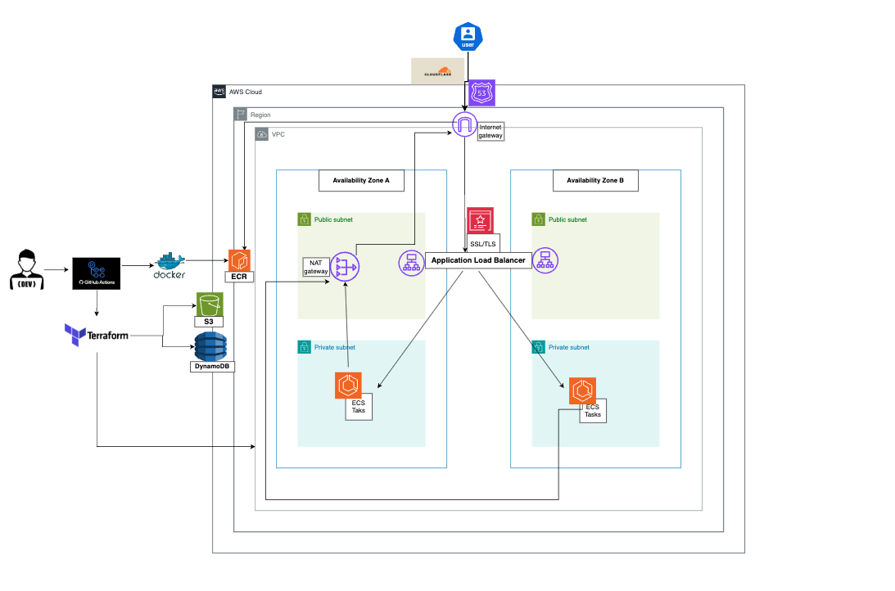

## Overview

This project demonstrates a complete end-to-end deployment of a containerised application to AWS using modern DevOps and cloud-native best practices. Infrastructure is provisioned using Terraform with a modular structure, enabling reusable, scalable, and environment-agnostic deployments. The application is built and containerised with Docker, stored in Amazon ECR, and deployed to Amazon ECS using Fargate for serverless container orchestration. A GitHub Actions CI/CD pipeline automates build, test, image publishing, and deployment workflows.

The solution follows AWS best practices for security, networking, and scalability, with workloads isolated and protected using least-privilege access and controlled network boundaries. The application is exposed through a custom domain, providing a production-style setup that is secure, maintainable, and ready for real-world use.

---

## Table of Contents

1. [Overview](#overview)
2. [Tools Used](#tools-used)
3. [Architecture](#architecture)
4. [Architecture Features](#architecture-features)
5. [Directory Structure](#directory-structure)
6. [Local Setup](#local-setup)

---

### Tools Used

This project leverages the following tools to ensure a robust, scalable, and automated deployment pipeline:

- **Docker**: Used for containerizing the application, ensuring consistency across development, testing, and production environments. Docker simplifies dependency management and enables seamless application portability.

- **AWS**: Provides the cloud infrastructure for hosting the application. Services like ECS Fargate, ECR, VPC, and Route53 are utilized to ensure a secure, scalable, and highly available deployment.

- **Terraform**: Employed for Infrastructure as Code (IaC), enabling the provisioning and management of AWS resources in a modular, reusable, and version-controlled manner. Terraform ensures consistent and repeatable infrastructure deployments.

- **GitHub Actions**: Automates the CI/CD pipeline, handling tasks such as building the Docker image, running tests, publishing the image to ECR, and deploying the application to AWS. This ensures a streamlined and efficient development workflow.

These tools collectively enable a modern DevOps approach, ensuring the application is production-ready and adheres to best practices.

---

## Architecture



---

## Architecture Features

- **ECS Fargate** for serverless container orchestration.
- **Application Load Balancer (ALB)** for traffic distribution.
- **VPC** with public and private subnets for network isolation.
- **NAT Gateway** for secure outbound internet access.
- **ACM** for managing TLS certificates.
- **Route53** for DNS management.
- **ECR** as the container registry.

---

## Directory Structure

```bash
./
├── .github
│   └── workflows
│       ├── docker.yml
│       ├── deploy.yml
│       └── destroy.yml
├── infra
│   ├── main.tf
│   ├── provider.tf
│   ├── variables.tf
│   ├── terraform.tfvars
│   ├── outputs.tf
│   ├── modules
│   │   ├── vpc
│   │   ├── security
│   │   ├── alb
│   │   ├── ecs
│   │   ├── acm
│   │   └── route53
├── packages #application
├── Dockerfile
├── compose.yml
├── .dockerignore
├── .gitignore
└── README.md

```

---

## Local Setup

1. **Clone the repository**:
   git clone <this_repo>

2. **Set up environment variables**:
   Create a `.env` file in packages directory and add the required environment variables.

3. **Build the Docker image**:

   ```bash
   docker build -t movie-searcher .
   ```

4. **Run the application**:

   ```bash
   docker-compose up
   docker run -p 8080:8080 movie-searcher --> to access the app navigate to `http://localhost:8080`
   ```

5. **Access the application**:
   Open your browser and navigate to `http://localhost:PORT` (replace `PORT` with the configured port in `compose.yml`).

---
